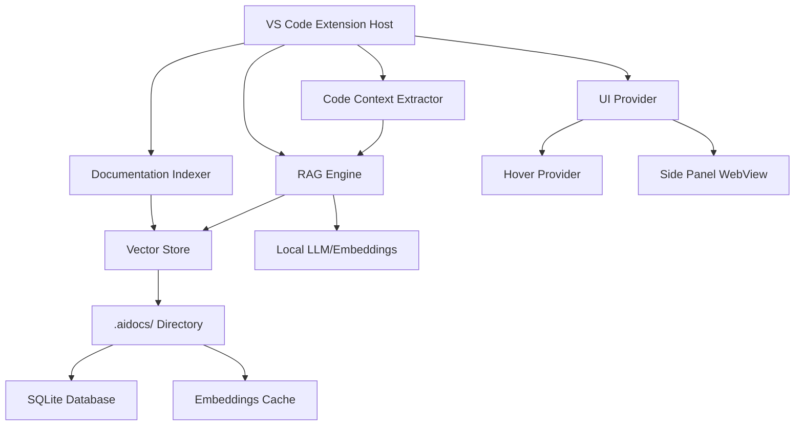

# Design Document: AI-powered Documentation Interpreter

## Overview

The AI-powered Documentation Interpreter is a VS Code extension that provides grounded code explanations using only project documentation. The system implements a Retrieval-Augmented Generation (RAG) architecture with local vector storage to ensure explanations are strictly based on indexed markdown documentation without hallucination.

The extension follows a modular architecture with clear separation between documentation indexing, vector storage, code context extraction, RAG inference, and user interface components. All processing occurs locally without internet access, ensuring privacy and reliability.

## Architecture

The system consists of five main components:



### Component Interactions

1. **Documentation Indexer** scans markdown files and creates embeddings stored in the Vector Store
2. **Code Context Extractor** captures selected code and extracts relevant context
3. **RAG Engine** retrieves relevant documentation chunks and generates grounded explanations
4. **UI Provider** displays explanations through hover tooltips and side panel
5. **Vector Store** manages local embeddings and performs similarity search

## Components and Interfaces

### Extension Entry Point (`extension.ts`)

```typescript
interface ExtensionContext {
  subscriptions: vscode.Disposable[];
  extensionPath: string;
  workspaceState: vscode.Memento;
}

interface AIDocsExtension {
  activate(context: ExtensionContext): void;
  deactivate(): void;
  registerCommands(): void;
  registerProviders(): void;
}
```

**Responsibilities:**
- Register VS Code commands: "AI Docs: Index Documentation" and "AI Docs: Explain Selected Code"
- Initialize core components (DocumentationIndexer, VectorStore, RAGEngine, UIProvider)
- Manage extension lifecycle and activation for JavaScript/Node.js projects only
- Handle workspace changes and project detection

### Documentation Indexer (`indexer/DocumentationIndexer.ts`)

```typescript
interface DocumentationChunk {
  id: string;
  filePath: string;
  sectionHeading: string;
  content: string;
  embedding?: number[];
  metadata: {
    level: number; // Header level (1-6)
    wordCount: number;
    lastModified: Date;
  };
}

interface DocumentationIndexer {
  indexWorkspace(): Promise<void>;
  scanMarkdownFiles(): Promise<string[]>;
  processFile(filePath: string): Promise<DocumentationChunk[]>;
  splitByHeaders(content: string, filePath: string): DocumentationChunk[];
  generateEmbeddings(chunks: DocumentationChunk[]): Promise<DocumentationChunk[]>;
}
```

**Responsibilities:**
- Scan README.md in project root and docs/**/*.md files recursively
- Split content by markdown headers (#, ##, ###) into DocumentationChunk objects
- Generate embeddings for each chunk using local embedding models
- Store processed chunks in vector store with complete metadata
- Persist indexed data locally in .aidocs/ folder within the project
- Process only markdown format files (.md extension)

### Vector Store (`storage/VectorStore.ts`)

```typescript
interface VectorStore {
  initialize(): Promise<void>;
  storeChunks(chunks: DocumentationChunk[]): Promise<void>;
  searchSimilar(query: string, topK: number): Promise<DocumentationChunk[]>;
  generateEmbedding(text: string): Promise<number[]>;
  clearIndex(): Promise<void>;
}

interface VectorStoreConfig {
  dbPath: string;
  embeddingModel: string;
  similarityThreshold: number;
  maxResults: number;
}
```

**Implementation Options:**
- **SQLite with sqlite-vss extension** for vector similarity search (preferred for local storage)
- **FAISS with LangChain.js** for efficient local vector operations
- **Universal Sentence Encoder** for generating embeddings locally without internet access

**Design Rationale:**
- SQLite is chosen for its reliability, local-first approach, and excellent VS Code extension compatibility
- Local embedding generation ensures complete offline operation as required
- Vector similarity search enables semantic matching beyond exact keyword matches

### Code Context Extractor (`context/CodeContextExtractor.ts`)

```typescript
interface CodeContext {
  selectedText: string;
  fileName: string;
  functionName?: string;
  className?: string;
  imports: string[];
  surroundingContext: string;
  language: string;
}

interface CodeContextExtractor {
  extractFromSelection(document: vscode.TextDocument, selection: vscode.Selection): CodeContext;
  extractSymbolName(text: string): string | undefined;
  extractImports(document: vscode.TextDocument): string[];
  buildQueryString(context: CodeContext): string;
}
```

**Responsibilities:**
- Extract selected code text and surrounding context from VS Code selections
- Identify function/class names using AST parsing for JavaScript/TypeScript code
- Capture file imports and dependencies for context enrichment
- Generate optimized search queries for vector store retrieval
- Handle code selections of any size from single symbols to multiple lines
- Use extracted context as the primary query for documentation retrieval

### RAG Engine (`rag/RAGEngine.ts`)

```typescript
interface RAGEngine {
  explainCode(context: CodeContext): Promise<ExplanationResult>;
  retrieveRelevantDocs(query: string): Promise<DocumentationChunk[]>;
  generateExplanation(context: CodeContext, docs: DocumentationChunk[]): Promise<string>;
  validateResponse(response: string, docs: DocumentationChunk[]): boolean;
}

interface ExplanationResult {
  explanation: string;
  citations: Citation[];
  confidence: number;
  hasRelevantDocs: boolean;
}

interface Citation {
  filePath: string;
  sectionHeading: string;
  relevanceScore: number;
}
```

**Prompt Template:**
```
SYSTEM: You are a code documentation assistant. Answer ONLY using the provided documentation excerpts. If the documentation doesn't contain relevant information, respond with "Not documented."

CONTEXT: 
${retrievedDocumentationChunks}

USER: Explain this code:
${codeContext}

Requirements:
- Use only information from the provided documentation
- Include specific citations for each claim (file path and section heading)
- Be concise and accurate
- No speculation or general programming knowledge
- Use low temperature settings for deterministic output
- Avoid speculative language and generic explanations
```

**Design Rationale:**
- Strict system instruction prevents hallucination and ensures grounding in project documentation
- "Not documented." response provides clear feedback when documentation is insufficient
- Citation requirements enable traceability and verification of explanations
- Low temperature settings ensure deterministic behavior for identical code selections

### UI Provider (`ui/UIProvider.ts`)

```typescript
interface UIProvider {
  registerHoverProvider(): vscode.HoverProvider;
  registerSidePanel(): vscode.WebviewViewProvider;
  showExplanation(result: ExplanationResult): void;
  formatHoverText(explanation: string): vscode.MarkdownString;
  updateSidePanel(result: ExplanationResult): void;
}

interface HoverProvider extends vscode.HoverProvider {
  provideHover(
    document: vscode.TextDocument,
    position: vscode.Position,
    token: vscode.CancellationToken
  ): Promise<vscode.Hover | undefined>;
}
```

**UI Components:**
- **Hover Provider**: 2-3 line explanations with basic formatting for quick reference
- **Side Panel WebView**: Full explanations with citations, bullet points, and markdown rendering
- **Status Bar**: Indexing progress and system status indicators

**Design Rationale:**
- Hover provider offers immediate, non-intrusive explanations for quick reference
- Side panel provides comprehensive explanations with full citation details
- Dynamic updates ensure explanations stay relevant as code selection changes
- Markdown rendering preserves documentation formatting and readability

## Data Models

### Documentation Storage Schema

```sql
-- SQLite schema for vector storage
CREATE TABLE documentation_chunks (
  id TEXT PRIMARY KEY,
  file_path TEXT NOT NULL,
  section_heading TEXT NOT NULL,
  content TEXT NOT NULL,
  embedding BLOB, -- Serialized vector
  word_count INTEGER,
  header_level INTEGER,
  last_modified DATETIME,
  created_at DATETIME DEFAULT CURRENT_TIMESTAMP
);

CREATE INDEX idx_file_path ON documentation_chunks(file_path);
CREATE INDEX idx_section_heading ON documentation_chunks(section_heading);
```

### Configuration Schema

```typescript
interface ExtensionConfig {
  indexing: {
    includePaths: string[];
    excludePaths: string[];
    maxFileSize: number;
    autoReindex: boolean;
  };
  retrieval: {
    topK: number;
    similarityThreshold: number;
    maxContextLength: number;
  };
  ui: {
    hoverEnabled: boolean;
    sidePanelEnabled: boolean;
    maxHoverLines: number;
  };
}
```

### Cache Management

```typescript
interface ExplanationCache {
  key: string; // Hash of code context
  explanation: string;
  citations: Citation[];
  timestamp: Date;
  ttl: number; // Time to live in milliseconds
}
```

**Design Rationale:**
- Symbol-based caching improves performance for frequently accessed code
- TTL ensures cache freshness when documentation is updated
- Hash-based keys provide efficient lookup and collision avoidance

## Project Structure and Implementation

### TypeScript Implementation Structure

The extension follows VS Code extension best practices with a modular TypeScript architecture:

```
src/
├── extension.ts                 // Main extension entry point
├── indexer/
│   └── DocumentationIndexer.ts // Documentation scanning and processing
├── storage/
│   └── VectorStore.ts          // Local vector storage and similarity search
├── context/
│   └── CodeContextExtractor.ts // Code analysis and context extraction
├── rag/
│   └── RAGEngine.ts            // Retrieval-augmented generation logic
├── ui/
│   ├── UIProvider.ts           // UI coordination and management
│   ├── HoverProvider.ts        // Hover tooltip implementation
│   └── SidePanelProvider.ts    // WebView side panel implementation
├── cache/
│   └── ExplanationCache.ts     // Performance caching system
└── types/
    └── interfaces.ts           // Shared TypeScript interfaces
```

**Design Rationale:**
- Clear separation of concerns enables maintainable and testable code
- Modular structure allows independent development and testing of components
- TypeScript provides type safety and better developer experience
- Follows VS Code extension conventions for seamless integration

### Quality Guardrails Implementation

The system implements multiple layers of quality control to ensure reliable, grounded explanations:

**Documentation Requirement Enforcement:**
- Reject explanation requests when no relevant documentation is retrieved
- Implement minimum relevance threshold for documentation chunks
- Validate that explanations reference provided documentation

**Language and Content Controls:**
- Avoid speculative language in all generated explanations
- Prevent generic programming explanations not grounded in project documentation
- Enforce citation requirements for all claims and statements

**Deterministic Behavior:**
- Use consistent hashing for identical code selections
- Implement deterministic LLM settings (low temperature, fixed seed)
- Cache explanations to ensure identical results for repeated queries

**Design Rationale:**
- Multiple validation layers prevent hallucination and ensure accuracy
- Deterministic behavior builds user trust and system reliability
- Strict documentation grounding maintains the core value proposition

## Correctness Properties

*A property is a characteristic or behavior that should hold true across all valid executions of a system-essentially, a formal statement about what the system should do. Properties serve as the bridge between human-readable specifications and machine-verifiable correctness guarantees.*

### Property Reflection

After analyzing all acceptance criteria, several properties can be consolidated to eliminate redundancy:

- Properties related to "all code symbols/selections" can be combined into comprehensive properties
- Properties about metadata presence can be unified into single validation properties  
- Properties about offline operation are redundant and can be consolidated
- Properties about file scanning can be combined into comprehensive directory traversal properties

### Correctness Properties

Property 1: **Extension activation scope**
*For any* VS Code workspace, the extension should activate if and only if the workspace contains JavaScript/Node.js project indicators (package.json, .js files, etc.)
**Validates: Requirements 1.5**

Property 2: **Markdown file discovery**
*For any* project directory structure containing markdown files, the indexer should discover README.md in the project root and all markdown files in docs/**/*.md paths recursively
**Validates: Requirements 2.1, 2.2**

Property 3: **Content chunking consistency**
*For any* markdown content with headers, splitting by markdown headers should produce chunks where each chunk contains exactly one section with its heading and content
**Validates: Requirements 2.3**

Property 4: **Chunk metadata completeness**
*For any* documentation chunk created during indexing, the chunk should contain all required metadata fields: file path, section heading, content, and header level
**Validates: Requirements 2.4**

Property 5: **File type filtering**
*For any* directory containing mixed file types, the indexer should process only files with .md extension and ignore all other file types
**Validates: Requirements 2.6**

Property 6: **Local data persistence**
*For any* indexed documentation, the system should persist all data locally in a .aidocs/ folder within the project without requiring internet access
**Validates: Requirements 2.5, 3.5**

Property 7: **Embedding generation completeness**
*For any* documentation chunk processed by the vector store, an embedding vector should be generated and associated with that chunk
**Validates: Requirements 3.1**

Property 8: **Similarity search ranking**
*For any* query to the vector store, returned results should be ordered by similarity score in descending order (most similar first)
**Validates: Requirements 3.4**

Property 9: **Code context capture**
*For any* code selection in a JavaScript file, the context extractor should capture the selected text, file name, and import statements
**Validates: Requirements 4.1, 4.3**

Property 10: **Symbol name extraction**
*For any* code selection containing function or class definitions, the context extractor should successfully extract the function or class name
**Validates: Requirements 4.2**

Property 11: **Selection size handling**
*For any* code selection ranging from single characters to multiple lines, the context extractor should handle the selection without errors and produce valid context
**Validates: Requirements 4.5**

Property 12: **Documentation retrieval consistency**
*For any* code explanation request, the RAG engine should retrieve documentation chunks and include them in the generated prompt
**Validates: Requirements 5.1, 5.3**

Property 13: **System instruction inclusion**
*For any* prompt generated by the RAG engine, the prompt should contain the system instruction "Answer only from provided documentation excerpts"
**Validates: Requirements 5.2**

Property 14: **Citation attachment**
*For any* explanation generated with retrieved documentation, the explanation should include citations referencing the source file and section heading
**Validates: Requirements 5.6**

Property 15: **Hover explanation length constraint**
*For any* hover explanation generated, the explanation should be formatted to 2-3 lines maximum
**Validates: Requirements 6.1**

Property 16: **Side panel formatting**
*For any* explanation displayed in the side panel, the content should be formatted with bullet points and include explicit citations
**Validates: Requirements 6.2, 6.3**

Property 17: **Markdown rendering support**
*For any* explanation containing markdown syntax, the UI should render the markdown properly with formatting preserved
**Validates: Requirements 6.4**

Property 18: **Dynamic explanation updates**
*For any* change in code selection, the explanation should update to reflect the new selection context
**Validates: Requirements 6.5**

Property 19: **Documentation requirement enforcement**
*For any* explanation request where no relevant documentation is found, the system should reject the request or respond with "Not documented."
**Validates: Requirements 7.1**

Property 20: **Explanation caching**
*For any* code symbol that has been explained before, requesting an explanation for the same symbol should return the cached result
**Validates: Requirements 7.4**

Property 21: **Deterministic behavior**
*For any* identical code selection provided multiple times, the system should generate identical explanations
**Validates: Requirements 7.5**

## Error Handling

### Documentation Indexing Errors

- **File Access Errors**: Handle permission denied, file not found, and corrupted files gracefully
- **Parsing Errors**: Skip malformed markdown files and log warnings without stopping indexing
- **Storage Errors**: Provide clear error messages for disk space and database issues
- **Embedding Generation Errors**: Retry failed embeddings with exponential backoff

### Vector Store Errors

- **Database Connection Errors**: Implement connection pooling and retry logic
- **Query Errors**: Validate queries before execution and provide meaningful error messages
- **Similarity Search Errors**: Handle empty results and malformed queries gracefully
- **Storage Capacity Errors**: Implement cleanup strategies for old embeddings

### RAG Engine Errors

- **No Documentation Found**: Return "Not documented." message consistently
- **LLM Generation Errors**: Implement fallback responses and error logging
- **Context Length Errors**: Truncate context intelligently while preserving meaning
- **Citation Errors**: Ensure citations are always included even if incomplete

### UI Errors

- **Hover Provider Errors**: Fail silently without disrupting editor experience
- **WebView Errors**: Display error messages in side panel instead of crashing
- **Selection Errors**: Handle invalid selections and empty selections gracefully
- **Rendering Errors**: Fallback to plain text if markdown rendering fails

## Testing Strategy

### Dual Testing Approach

The system requires both unit tests and property-based tests to ensure comprehensive coverage:

**Unit Tests** focus on:
- Specific examples of markdown parsing edge cases
- Integration points between components
- Error conditions and boundary cases
- VS Code API integration points

**Property-Based Tests** focus on:
- Universal properties that hold across all inputs
- Comprehensive input coverage through randomization
- Validation of correctness properties defined above

### Property-Based Testing Configuration

- **Testing Library**: Use `fast-check` for TypeScript property-based testing
- **Test Iterations**: Minimum 100 iterations per property test
- **Test Tagging**: Each property test must reference its design document property
- **Tag Format**: `// Feature: ai-docs-interpreter, Property {number}: {property_text}`

### Testing Framework Integration

**VS Code Extension Testing**:
- Use `@vscode/test-electron` for extension integration tests
- Mock VS Code APIs for unit testing components
- Use temporary workspaces for testing indexing functionality

**Vector Store Testing**:
- Test with in-memory SQLite databases for fast execution
- Generate synthetic embeddings for testing similarity search
- Test with various document sizes and structures

**RAG Engine Testing**:
- Mock LLM responses for deterministic testing
- Test prompt construction with various context sizes
- Validate citation extraction and formatting

### Test Data Generation

**Synthetic Documentation**:
- Generate markdown files with various header structures
- Create realistic code examples for context extraction
- Generate embeddings with known similarity relationships

**Edge Case Coverage**:
- Empty files, malformed markdown, very large files
- Code selections at file boundaries, empty selections
- Missing documentation, corrupted embeddings
- Network failures, disk space issues

The testing strategy ensures that both specific examples work correctly (unit tests) and that universal properties hold across all possible inputs (property-based tests), providing comprehensive validation of the system's correctness properties.